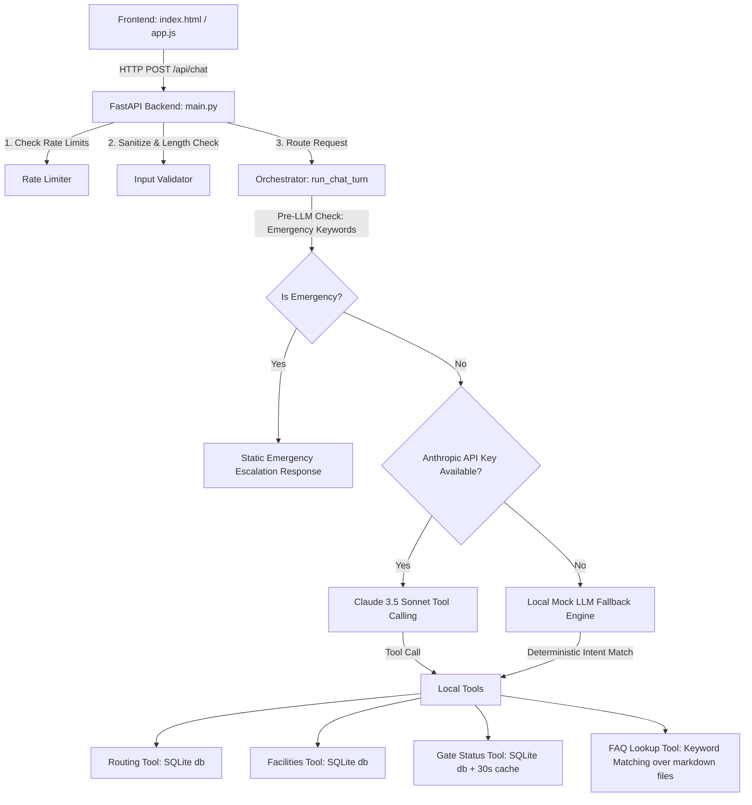

# FIFA World Cup 2026 Stadium Navigation & Info Assistant

An accessibility-aware, multilingual, and secure venue assistant designed for fans attending the FIFA World Cup 2026. The app supports step-free wheelchair routing, multi-language speech-to-text (STT) and text-to-speech (TTS), structured venue tool calls, policy lookup, and strict safety boundaries.

---

## 🏛️ System Architecture



### Folder Structure
```
directlingual/
├── backend/
│   ├── main.py                 # FastAPI app, routing, rate limiting configuration
│   ├── orchestrator.py         # Prompt engineering, emergency intercept, LLM/Mock routing
│   ├── tools/
│   │   ├── routing.py          # get_route() (returns standard vs. step-free path instructions)
│   │   ├── gate_status.py      # get_gate_status() (current wait times & status with 30s cache)
│   │   ├── facilities.py       # get_facility() (finds nearest concessions/toilets sorted by proximity)
│   │   └── faq.py              # faq_lookup() (fuzzy keyword search over markdown knowledge bases)
│   ├── data/
│   │   ├── init_db.py          # DB schema definition & seed data script
│   │   ├── venue.db            # SQLite database
│   │   └── faq_kb/             # Markdown files containing venue policies:
│   │       ├── bag_policy.md
│   │       ├── emergencies.md
│   │       ├── prohibited_items.md
│   │       └── ticketing.md
│   ├── security/
│   │   ├── input_validation.py # HTML sanitization, script block stripping, and length constraints (max 400 chars)
│   │   └── rate_limiter.py     # Thread-safe sliding window rate-limiter
│   └── tests/
│       ├── test_tools.py       # Unit tests for database queries and cache
│       ├── test_orchestrator.py# Integration tests for LLM orchestration and emergency escalation
│       └── test_adversarial.py # Adversarial tests covering prompt injections, HTML injection, etc.
├── frontend/
│   ├── index.html              # Fully semantic ARIA-compliant HTML layout with voice capabilities
│   ├── style.css               # Modern glassmorphism UI with high contrast and sizing overrides
│   └── app.js                  # Speech-to-Text (STT), Text-to-Speech (TTS), AJAX, and keyboard shortcuts
├── run.py                      # Local server entry point
├── pyproject.toml              # Project configuration (pytest configurations)
└── requirements.txt            # Python dependencies
```

---

## ⚙️ Core Subsystems

### 1. Security Safeguards
* **Rate Limiting**: Implemented via a thread-safe sliding window rate limiter (`RateLimiter` in [rate_limiter.py](file:///d:/directlingual/backend/security/rate_limiter.py)). Limits clients to 15 requests per 60-second window.
* **Input Sanitization**: In [input_validation.py](file:///d:/directlingual/backend/security/input_validation.py), user text is checked for:
  - Input length limit of **400 characters**.
  - Script tag injection blocking and removal using regular expressions (`<script.*?>.*?</script>`).
  - General HTML tag stripping.
* **Emergency Escalation (Safety Boundary)**: The orchestrator intercepts any messages containing high-risk keywords (e.g., *bomb, gun, chest pain, fire, medical emergency, shooter*) pre-LLM, immediately bypassing LLM processing to display static emergency assistance instructions.

### 2. LLM Orchestration & Fallback Engine
* **Claude 3.5 Sonnet Integration**: When an `ANTHROPIC_API_KEY` is provided, Claude orchestrates tool selection, parsing user intent to trigger DB-backed query tools.
* **Deterministic Fallback Engine**: If the API key is not present, a deterministic rule-based intent-matching engine acts as a fallback to parse routing, gate status, and facility requests, preserving multi-lingual matching in English, Spanish, and French.

### 3. Venue Assistant Tools
* **Routing Tool ([routing.py](file:///d:/directlingual/backend/tools/routing.py))**: Fetches paths between two points in the database. Supports two distinct pathways:
  1. **Standard Route**: Escalators, stairs, and direct path instructions.
  2. **Step-Free Route**: Tailored for accessibility (wheelchairs/strollers) utilizing elevator hubs, ramps, and level concourses.
* **Gate Status Tool ([gate_status.py](file:///d:/directlingual/backend/tools/gate_status.py))**: Fetches opening statuses and wait times for stadium gates. Utilizes an in-memory dictionary-based thread-safe cache with a **30-second Time-To-Live (TTL)**.
* **Facilities Tool ([facilities.py](file:///d:/directlingual/backend/tools/facilities.py))**: Locates nearest services (toilets, prayer rooms, elevators, concession stands, first aid) and sorts results based on their distance to a provided section number.
* **FAQ Knowledge Base Tool ([faq.py](file:///d:/directlingual/backend/tools/faq.py))**: A keyword-scoring search engine that parses markdown files in `backend/data/faq_kb/` to match queries regarding policies (bag policy, ticketing, prohibited items, emergencies).

### 4. Accessible UI (Frontend)
* **Web Speech API integration**: Built-in voice input (Speech Recognition) and output (Speech Synthesis) to assist users with visual/motor impairments.
* **Accessibility Overrides**: Dedicated UI toggles for high-contrast colors and increased font size.
* **Keyboard Hotkeys**:
  - `Ctrl + Space` triggers voice search immediately.
  - `Esc` returns focus to the chat input field.

---

## 🚀 Getting Started

### 1. Prerequisites
- Python 3.10+ installed on your system.

### 2. Installation
Install the required packages:
```bash
pip install -r requirements.txt
```

### 3. Initialize the Database
Seed the SQLite database with the stadium layout, facilities, and routes:
```bash
python backend/data/init_db.py
```

### 4. Running the Server
Start the FastAPI server:
```bash
python run.py
```
Open [http://localhost:8000](http://localhost:8000) in your web browser.

---

## 🧪 Testing

The repository contains a robust suite of 22 tests spanning unit, integration, and security checks.

To execute the test suite:
```bash
python -m pytest backend/tests/
```
