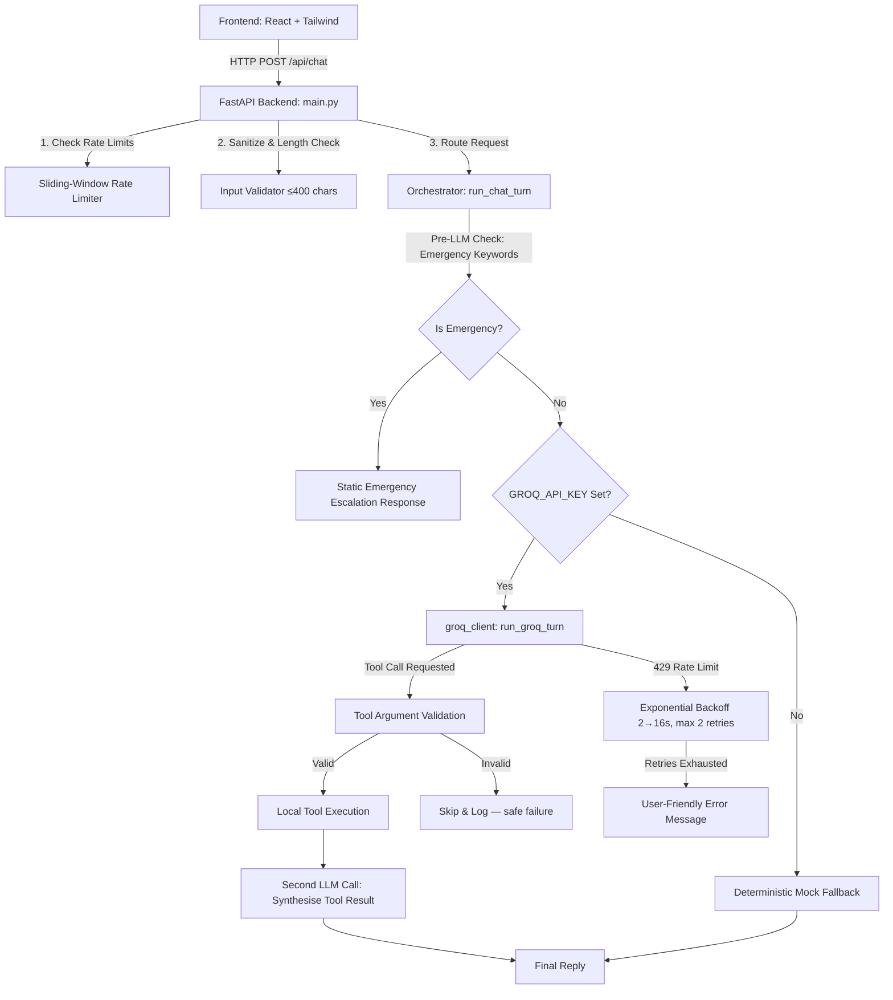

# FIFA World Cup 2026 Stadium Navigation & Info Assistant

An accessibility-aware, multilingual, and secure venue assistant designed for fans attending the FIFA World Cup 2026. Fans can get step-free routing, gate wait times, facility locations, and policy answers in their own language — via text or voice — directly from their phones inside the stadium.

---

## 🏛️ System Architecture



### Folder Structure
```
directlingual/
├── backend/
│   ├── main.py                 # FastAPI app, routing, rate limiting
│   ├── orchestrator.py         # Emergency intercept, Groq/mock routing
│   ├── config.py               # All named constants (model, limits, timeouts)
│   ├── services/
│   │   └── groq_client.py      # Single module owning ALL Groq API calls
│   ├── tools/
│   │   ├── routing.py          # get_route() — standard & step-free paths
│   │   ├── gate_status.py      # get_gate_status() — 30s in-memory cache
│   │   ├── facilities.py       # get_facility() — proximity-sorted results
│   │   └── faq.py              # faq_lookup() — keyword search over Markdown KB
│   ├── data/
│   │   ├── init_db.py          # DB schema & seed data
│   │   ├── venue.db            # SQLite database (generated at runtime)
│   │   └── faq_kb/             # Markdown policy files
│   │       ├── bag_policy.md
│   │       ├── emergencies.md
│   │       ├── prohibited_items.md
│   │       └── ticketing.md
│   ├── security/
│   │   ├── input_validation.py # HTML sanitisation, script stripping, length cap
│   │   └── rate_limiter.py     # Thread-safe sliding-window rate limiter
│   └── tests/
│       ├── test_groq_client.py # Unit tests for Groq client (no real API calls)
│       ├── test_tools.py       # Unit tests for DB query tools
│       ├── test_orchestrator.py# Integration tests for chat turn + emergency
│       └── test_adversarial.py # Prompt injection & HTML injection security tests
├── frontend/
│   ├── index.html              # React + Tailwind CDN, accessibility CSS overrides
│   ├── style.css               # High-contrast & large-text CSS variables
│   └── app.js                  # React components: ChatWindow, RouteCard,
│                               #   GateStatusBadge, FacilityCard, InputBar,
│                               #   QuickActions, A11yControls
├── .env.example                # Placeholder — copy to .env and fill in keys
├── .gitignore                  # Excludes .env, __pycache__, venue.db, logs
├── run.py                      # Local server entry point
├── pyproject.toml              # pytest configuration
└── requirements.txt            # Python dependencies
```

---

## 🤖 LLM Model: Why `meta-llama/llama-4-scout-17b-16e-instruct`

| Criterion | Decision |
|---|---|
| **Tool/function calling** | ✅ Supports parallel tool use — critical for multi-step venue queries (e.g. routing + gate-status in a single turn) |
| **Free-tier TPM** | **30 000 TPM** — highest of all free-tier tool-calling models. TPM is the tighter constraint at our usage level, more so than RPM. |
| **Free-tier RPM** | 30 requests/minute |
| **Free-tier RPD** | 1 000 requests/day |
| **Free-tier TPD** | 500 000 tokens/day |
| **Context window** | 131 072 tokens — no risk of exceeding window during a typical demo session |
| **Latency** | Served on Groq's LPU hardware — sub-second TTFT keeps the mobile chat UI responsive |

> **Note:** Rate limits apply at the **organisation level**, not per API key. Do not attempt to bypass limits with multiple keys — this violates Groq's Terms of Service.
>
> Always verify current limits at [console.groq.com/docs/rate-limits](https://console.groq.com/docs/rate-limits) before presenting, as Groq updates these regularly.

---

## ⚙️ Core Subsystems

### 1. Groq API Integration ([groq_client.py](file:///d:/directlingual/backend/services/groq_client.py))

All LLM interactions are owned by a single module — no other file imports the `openai` SDK directly.

| Feature | Implementation |
|---|---|
| **Tool calling** | OpenAI function-calling schema, parallel tool use enabled |
| **Quota monitoring** | Reads `x-ratelimit-remaining-requests`, `x-ratelimit-remaining-tokens`, `x-ratelimit-reset-*` response headers and logs them on every call |
| **429 handling** | Reads `Retry-After` header; falls back to exponential back-off (`2^attempt` seconds, capped at 16 s); up to 2 retries |
| **Timeout** | 20 s wall-clock limit; `APITimeoutError` surfaces as a user-facing message immediately (no retry — retrying a timed-out call under pressure makes things worse) |
| **Argument validation** | Model-returned tool arguments are validated against strict schema rules _before_ executing any local DB query |
| **Log hygiene** | Only error types and status codes are logged — raw user text is **never** written to logs |

### 2. Demo-Day Fallback Mode

Set `DEMO_MODE=true` in your `.env` to bypass the Groq API entirely. The client returns canned, realistic responses for route, gate-status, facility, and bag-policy queries. This is a **deliberate resilience safeguard**, not a hack — it ensures the live demo succeeds even if the free-tier daily quota (1 000 RPD) is exhausted during judging.

```bash
# .env
DEMO_MODE=true
```

This mode is documented explicitly because it is a legitimate engineering decision: presenting a reliable demo is more important than proving the API is live, and judges can verify the real API path by toggling `DEMO_MODE=false`.

### 3. Security Safeguards

* **Rate Limiting**: Thread-safe sliding-window limiter — 15 requests/IP/60 s.
* **Input Sanitisation**: Strips `<script>` blocks and all HTML tags; enforces 400-character limit before any text reaches the LLM.
* **System Prompt Separation**: Trusted instructions are in the system role. User content is always in the user role and is explicitly framed as untrusted data.
* **Tool Argument Validation**: Gate names, facility types, section numbers, and FAQ queries are validated against known-safe schemas before executing any SQLite query.
* **Emergency Escalation**: Safety keywords (bomb, fire, medical emergency, etc.) are intercepted **pre-LLM** — no API tokens are consumed and a static emergency contact response is returned instantly.

### 4. Token Efficiency (Free-Tier Conscious)

| Measure | Detail |
|---|---|
| **Lean system prompt** | ~40 tokens — every system-prompt token is spent on every single call |
| **History trimming** | Last 8 turn-pairs only (`MAX_HISTORY_TURNS=8` in `config.py`) |
| **`max_tokens=512`** | Set deliberately; never left unbounded |
| **Gate-status cache** | 30 s in-memory TTL avoids redundant model + tool round-trips for the most frequently queried data |

---

## 🚀 Getting Started

### Prerequisites
- Python 3.10+
- Node.js 18+ (optional — only needed if you want to run the frontend dev server)

### 1. Clone & Install

```bash
pip install -r requirements.txt
```

### 2. Configure Environment

```bash
cp .env.example .env
# Edit .env and set GROQ_API_KEY=gsk_...
```

### 3. Initialise the Database

```bash
python backend/data/init_db.py
```

### 4. Run the Server

```bash
python run.py
```

Open [http://localhost:8000](http://localhost:8000).

> **Without a `GROQ_API_KEY`** the assistant automatically falls back to the deterministic mock engine — no configuration required for local testing.
>
> **With `DEMO_MODE=true`** the API is bypassed entirely and canned responses are returned.

---

## 🧪 Testing

The full suite of 25+ unit, integration, and adversarial tests runs without hitting the real Groq API:

```bash
python -m pytest backend/tests/ -v
```

### Test coverage

| File | What it tests |
|---|---|
| `test_groq_client.py` | 429 back-off, timeout, malformed tool-calls, arg validation, demo mode — **no real API calls** |
| `test_tools.py` | SQLite query tools and gate-status cache |
| `test_orchestrator.py` | Emergency escalation, full chat turn, mock fallback |
| `test_adversarial.py` | Prompt injection, HTML injection, length attacks, script tag stripping |

---

## 🔑 Environment Variables

| Variable | Required | Default | Description |
|---|---|---|---|
| `GROQ_API_KEY` | For live mode | — | Groq API key from [console.groq.com/keys](https://console.groq.com/keys) |
| `DEMO_MODE` | No | `false` | `true` → bypass Groq API, return canned responses |
| `PORT` | No | `8000` | Port the FastAPI server listens on |
